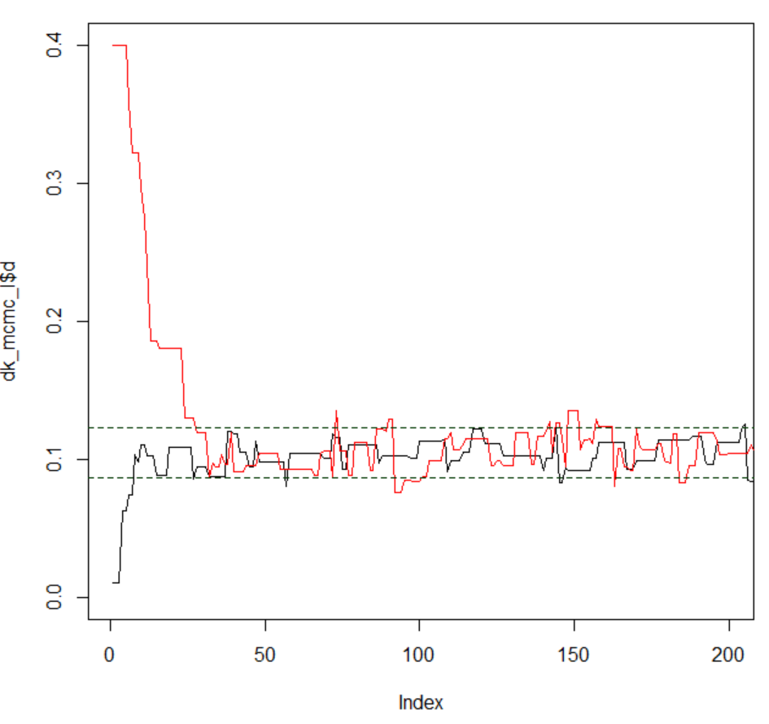

# Bayesian inference using Markov Chain Monte Carlo (MCMC): an `R` tutorial applied to phylogenetics

> [!IMPORTANT]
> This tutorial is based on the [`mcmc.K80.R` `R` script](https://github.com/mariodosreis/Bayesian_tutorial/blob/master/K80/mcmc.K80.R), which is part of the [`Bayesian_tutorial` repository](https://github.com/mariodosreis/Bayesian_tutorial) created by **Fabricia F. Nascimento** ([@thednainus](https://github.com/thednainus)), **Mario dos Reis** ([@mariodosreis](https://github.com/mariodosreis)), and **Ziheng Yang** ([@abacus-gene](https://github.com/abacus-gene)) as part of their article ["A biologist's guide to Bayesian phylogenetic analysis" (Nascimento et al. 2017)](http://rdcu.be/v4jM).<br><br>
>Before getting started, you are encouraged to read [Nascimento et al. (2017)](http://rdcu.be/v4jM) to gain a better understanding of the theory behind Bayesian phylogenetics so that you can make the most out of this tutorial!

## Software requirements

We are going to use the graphical interface `RStudio` to run the various code snippets written in `R` that you shall find in this tutorial. Before getting started, please follow the guidelines to install `R` and `RStudio` if you have not already installed them:

* `R`: please download `R` before `RStudio` to avoid any complications. To download `R`, and based on your OS, [please select either `Download R for Linux`, `Download R for macOS`, or `Download R for Windows` via this link](https://cran.r-project.org/); then follow the corresponding installation instructions for the latest stable version.

* `RStudio`: please only install `RStudio` once you have successfully installed `R`. You [can download `RStudio` via the following link](https://posit.co/download/rstudio-desktop/), then please follow the instructions to install this graphical interface according to your OS.

> [!IMPORTANT]
> If you are a **Windows user**, please make sure that you have the correct version of `RTools` installed, which will allow you to install packages from the source code if required. For instance, if you have `R v4.4.2`, then installing `RTools v4.4` shall be fine. If you have another `R` version installed on your PC, please check the corresponding `RTools` version prior to make sure it is compatible. For more information on which version you should download, [please go to the CRAN website by following this link and download the version you need](https://cran.r-project.org/bin/windows/Rtools/).

## PART 1: Bayesian inference overview

### Understanding the data

The data that we will be using for this practical session is the 12S rRNA alignment of human and orangutan, which consists of 948 base pairs and 90 differences (i.e., 84 transitions {"purine<->purine" or "pyrimidine<->pyrimidine"} and 6 transversions {"purine<->pyrimidine"}; purines are A and G and pyrimidines C and T):

> **Table 1**. Numbers and frequencies (in parantheses) of sites for the 16 site configurations (patterns) in human and orangutan mitochondrial 12s rRNA genes. This table is based on Table 1.3, page 7 in [Yang (2014)](http://abacus.gene.ucl.ac.uk/MESA/).

| Orangutan (below) \ Human (right)         | T               | C             | A              | G              | Sum $\pi_{i}$  |
|-------------------------------------------|-----------------|---------------|----------------|----------------|----------------|
| T                                         | 179 (0.188819)  | 23 (0.024262) | 1 (0.001055)   | 0 (0)          | 0.2141         |
| C                                         | 30 (0.03164646) | 219 (0.231013)| 2 (0.002110)   | 0 (0)          | 0.2648         |
| A                                         | 2 (0.002110)    | 1 (0.001055)  | 291 (0.306962) | 10 (0.010549)  | 0.3207         |
| G                                         | 0 (0)           | 0 (0)         | 21 (0.022152)  | 169 (0.178270) | 0.2004         |
| Sum($\pi_{j}$)                            | 0.2226          | 0.2563        | 0.3323         | 0.1888         | 1              |

> *Note*: GenBank accession numbers for the human and orangutan sequences are `D38112` and `NC_001646`, respectively ([Horai et al. (1995)](https://pubmed.ncbi.nlm.nih.gov/7530363/)). There are 954 sites in the alignment, but six sites involve alignment gaps and are removed, leaving 948 sites in each sequence. The average base frequencies in the two sequences are 0.2184 (T), 0.2605 (C), 0.3265 (A), and 0.1946 (G).

### Analysing the data under a specific evolutionary model

Firstly, we need to define the **variables** that help us summarise our **data**: the **length of the alignment**, the **total number of transitions** (i.e., A<->G or C<->T), and the **total number of transversions** (i.e., A<->T, G<->C, G<->T, A<->C):

```r
# Length of alignment in bp
n  <- 948
# Total number of transitions (23+30+10+21)
ns <- 84
# Total number of transversions (1+0+2+0+2+1+0+0)
nv <- 6
```

Then, we need to write a function in `R` that calculates the log-likelihood of our data given the two parameters  we are keen on estimating: the distance between the mitochondrial 12s rRNA genes of human and orangutan ($d$) and the transition/transversion ratio $\kappa=\alpha/\beta$. Please note that the log-likelihood function can change depending on the nucleotide substitution model assumed in phylogenetic analyses. In this practical session, we assume that the sequences in our data evolve under the Kimura's 1980 (K80) nucleotide substitution model (see page 8, [Yang (2014)](http://abacus.gene.ucl.ac.uk/MESA/)), which has one free model parameter, $\kappa$, to account for the fact that transitions and transversions may not occur at the same rate.

> **Q matrix for the K80 model**: equal base frequencies and one free model parameter $\kappa$.

$$\mathrm{Q=}\left(\begin{array}{cccc}
. & \alpha & \beta & \beta\\
\alpha & . & \beta & \beta\\
\beta & \beta & . & \alpha\\
\beta & \beta & \alpha & .
\end{array}\right)$$

$$\mathrm{Q=}\left(\begin{array}{cccc}
. & \kappa & 1 & 1\\
\kappa & . & 1 & 1\\
1 & 1 & . & \kappa\\
1 & 1 & \kappa & .
\end{array}\right)$$

When defining the log-likelihood function ($f(D|d,k)$ in this tutorial), we must decide which **arguments** we need to include. E.g.: we need to consider the **parameters we are keen on estimating** (e.g., in this tutorial, $\kappa$ as the free parameter in the K80 model and $d$ as the distance between orangutan and human sequences) and our **data**. In this example, the arguments we are going to specify in our function are the following:

* **Distance**, $d$.
* **Transition/transversion ratio**, $\kappa$.
* **Alignment length**, $n$. When analysing our dataset, we will fix the value of this argument to $n=948$.
* **Number of transitions**, $ns$. When analysing our dataset, we will fix the value of this argument to $ns=84$.
* **Number of transversions**, $nv$. When analysing our dataset, we will fix the value of this argument to $nv=6$.

```r
# Define log-likelihood function, f(D|d,k)
# This function uses Kimura's (1980) substitution model
# See p.8 in Yang (2014)
#
# Arguments:
#
#   d  Numeric, value for the distance between sequences
#   k  Numeric, value for model parameter kappa
#   n  Numeric, length of the alignment | Default: 948
#   ns Numeric, total number of transitions | Default: 84
#   nv Numeric, total number of transversions | Default: 6
k80.lnL <- function( d, k, n = 948, ns = 84, nv = 6 ) {

  # Define probabilities
  p0 <- .25 + .25 * exp( -4*d / ( k+2 ) ) + .5 * exp( -2*d*( k+1 ) / ( k+2 ) )
  p1 <- .25 + .25 * exp( -4*d / ( k+2 ) ) - .5 * exp( -2*d*( k+1 ) / ( k+2 ) )
  p2 <- .25 - .25 * exp( -4*d / ( k+2 ) )

  # Return log-likelihood
  return ( ( n - ns - nv ) * log( p0/4 ) +
            ns * log( p1/4 ) + nv * log( p2/4 ) )

}
```

Once we have defined our log-likelihood function, we have to create a vector of values for arguments `d` (i.e., $d$) and `k` (i.e., $\kappa$) so that we can calculate the log-likelihood of our data -- without values for these two arguments, the calculation cannot take place!<br>

Firstly, we are going to define 100 values for parameter $\kappa$ that range from 0 to 100 and another 100 values for parameter $d$ that range from 0 to 0.3. Then, we can use the in-built R function **`expand.grid`** to create a data frame that includes **all possible combinations of the values selected for $d$ and $\kappa$** (i.e., 10,000 possible combinations):

```r
# Number of values that are to be generated
# for d and k
dim <- 100
# Vector of d values
d_v <- seq( from = 0, to = 0.3, len = dim )
# Vector of k values
k_v <- seq( from = 0, to = 100, len = dim )
dk  <- expand.grid( d = d_v, k = k_v )
```

As expected, the resulting data frame object `dk` has 10,000 rows and 2 columns, which means that a total of 10,000 combinations for $d$ and $\kappa$ values have been recorded in this object. Now, we can pass these paired values of $d$ and $\kappa$ to arguments `d` and `k` specified in our `k80.lnL` function to calculate the log-likelihood of our data!

> [!IMPORTANT]
> We will save the log-likelihood values of our data given each pair of $d$ and $k$ values in a matrix (i.e., see object `lnL` in code snippet below). In order for us to generate some plots later, we are also re-scaling the log-likelihood values and calculating the corresponding likelihood values:

```r
# Calculate log-likelihood of the data, f(D|d,k),
# for all paired values of d and k
lnL <- matrix( k80.lnL( d = dk$d, k = dk$k ), ncol = dim )

# Re-scale the log-likelihood values and calculate
# the likelihood of the data for all paired values
# of d and k
L <- exp( lnL - max( lnL ) )
```

We have now calculated the likelihood of our data for all paired values of $d$ and $\kappa$ so... We need to set the **priors** for our parameters of interest!

In this example, we assume that the **molecular distance** between the sequences in our data should be somewhat around **0.1 substitutions per site**. Nevertheless, to account for the uncertainty in our estimated value, we are going to use a diffuse gamma distribution, thus setting the shape parameter value to $\alpha = 2$. We know that the mean of the Gamma distribution is $\alpha/beta$. Therefore, if we estimate our distance to be around 0.1, we know that $0.1=\alpha/\beta$. Now, it is easy to calculate $\beta$, $\beta = 2/0.1=20$, and we can now specify the prior for parameter $d$: $\Gamma(2,20)$. By following the same procedure, we can also specify the prior for parameter $\kappa$! We can vaguely assume that the transition/transversion ratio is $\kappa\approx 20$, and thus we specify the prior to be $\Gamma(2,0.1)$:

```r
# Specify priors for k and d, f(D)f(k)
Pri <- matrix( dgamma( x = dk$d, 2, 20 ) *
               dgamma( x = dk$k, 2, 0.1 ),
               ncol = dim )
```

Given that we have calculated the likelihood of our data for each specified paired value of $d$ and $\kappa$ and we have also defined the priors for these parameters of interest... We can now calculate the **unscaled posterior distribution (our target distribution)**!

```r
# Calculate unscaled posterior distribution, f(d)f(k)f(D|d,k)
Pos <- Pri * L
```

Once we have calculated the prior, the likelihood of the data, and the unscaled posterior, we can plot the corresponding densities by using the code snippet below:

```r
# Plot prior, likelihood, and unscaled posterior densities
# We want one row and three columns
par( mfrow = c( 1, 3 ) )
# We will use function `contour()` to create contour plots
# Plot prior density
image( x = d_v, y = k_v, z = -Pri, las = 1, col = heat.colors( 50 ),
       main = "Prior", xlab = "distance, d",
       ylab = "kappa, k", cex.main = 2.0,
       cex.lab = 1.5, cex.axis = 1.5 )
contour( x = d_v, y = k_v, z = Pri, nlev=10, drawlab = FALSE, add = TRUE )
# Plot likelihood density
image( x = d_v, y = k_v, z = -L, las = 1, col = heat.colors( 50 ),
       main = "Likelihood", xlab = "distance, d",
       ylab = "kappa, k", cex.main = 2.0,
       cex.lab = 1.5, cex.axis = 1.5 )
contour( x = d_v, y = k_v, z = L, nlev = 10,
         drawlab = FALSE, add = TRUE )
# Plot unscaled posterior density
image( x = d_v, y = k_v, z = -Pos, las = 1, col = heat.colors( 50 ),
       main = "Posterior", xlab = "distance, d",
       ylab = "kappa, k", cex.main = 2.0,
       cex.lab = 1.5, cex.axis = 1.5 )
contour( x = d_v, y = k_v, z = Pos, nlev = 10,
         drawlab = FALSE, add = TRUE )
```

<p align="center">
  
</p>

## PART 2: Markov Chain Monte Carlo (MCMC)

### Introduction to MCMC

In most practical problems, the marginal density (constant $z$ in equation below) can be very hard to compute, and thus approximating the target density using MCMC algorithms becomes the most feasible solution.<br>

In this example, instead of calculating our target density (posterior) using the equation below...

$$f(\kappa,d|D)=\frac{f(d)f(\kappa)f(D|d,\kappa)}{z}$$

... we are going to learn how we can **approximate** it during the MCMC:

$$f(\kappa,d|D)\propto f(d)f(\kappa)f(D|d,\kappa)$$

Following the first part of this tutorial, remember that we have (i) assumed that the sequences in our data evolve under the K80 model (we defined our log-likelihood function based on this model), and (ii) specified two Gamma priors for our parameters of interest based on our prior knowledge: $f(d)=\Gamma(d|2,20)$ and $f(\kappa)=\Gamma(\kappa|2,0.1)$. Now, we have everything we need to write a function in R that returns the unscaled posterior density when considering all the paired values of $d$ and $\kappa$:

```r
# Define function that returns the logarithm of the unscaled posterior:
# ---> f(d) * f(k) * f(D|d,k)
#
# The priors for our parameters of interest as set as follows:
# ---> f(d) = Gamma(d | 2, 20)
# ---> f(k) = Gamma(k | 2, 0.1)
#
# Arguments:
#
#   d     Numeric, value for the distance between sequences
#   k     Numeric, value for model parameter kappa
#   n     Numeric, length of the alignment | Default: 948
#   ns    Numeric, total number of transitions | Default: 84
#   nv    Numeric, total number of transversions | Default: 6
#   a_d   Numeric, value for parameter alpha in Gamma prior
#         for the distance (d) | Default: 2
#   b_d   Numeric, value for parameter beta in Gamma prior
#         for parameter distance (d) | Default: 20
#   a_k   Numeric, value for parameter alpha in Gamma prior
#         for parameter kappa (k) | Default: 2
#   b_k   Numeric, value for parameter beta in Gamma prior
#         for parameter kappa (k) | Default: 0.1
ulnPf <- function( d, k, n = 948, ns = 84, nv = 6,
                   a_d = 2, b_d = 20, a_k = 2, b_k = 0.1 ){

  # Gamma priors for d and kappa
  lnpriord <- ( a_d - 1 )*log( d ) - b_d * d
  lnpriork <- ( a_k - 1 )*log( k ) - b_k * k

  # Log-likelihood (K80 model)
  expd1 <- exp( -4*d / ( k+2 ) )
  expd2 <- exp( -2*d*( k+1 ) / ( k+2 ) )
  p0 <- .25 + .25 * expd1 + .5 * expd2
  p1 <- .25 + .25 * expd1 - .5 * expd2
  p2 <- .25 - .25 * expd1
  lnL <- ( ( n - ns - nv ) * log( p0 / 4 ) + ns * log( p1 / 4 ) + nv * log( p2 / 4 ) )

  # Return unnormalised posterior
  return ( lnpriord + lnpriork + lnL )
}
```

### The MCMC algorithm

Once we have defined the function to calculate the unscaled posterior distribution, we need to write the MCMC algorithm that we will use to sample from this target distribution!<br>

The algorithm that we will write follows the structure below:

* Part A: Firstly, set initial values for parameters $d$ and $\kappa$.
* Part B: Then, for every $n_{th}$ iteration:
  1. Propose a new state $d^{*}$ from an appropriate proposal density.
  2. Accept or reject the proposal with probability: $\mathrm{min}(1,p(d^{\*})p(x|d^{\*})/p(d)p(x|d))$. If the proposal is accepted, then keep $d=d^{*}$. Otherwise, keep current state for $d$ for the next iteration, $d=d$.
  3. Save $d$.
  4. Repeat steps 1-3 for $\kappa$.
  5. Go to step 1.

```r
# Define MCMC algorithm
#
# Arguments:
#
#   init_d  Numeric, initial state value for parameter d.
#   init_k  Numeric, initial state value for paramter k.
#   N       Numeric, number of iterations that the MCMC will run.
#   w_d     Numeric, width of the sliding-window proposal for d.
#   w_k     Numeric, width of the sliding-window proposal for k.
mcmcf <- function( init_d, init_k, N, w_d, w_k ) {

  # We keep the visited states for model parameters d and k
  # in vectors sample_d and sample_k for easy access
  # In practical MCMC applications, these vectors would be
  # output in a file
  # These two objects are numeric vectors of length N+1
  sample_d <- sample_k <- numeric( N+1 )

  # STEP 1: Set initial values to be used during the first
  #         iteration of the MCMC
  # 1.1. Get initial values for parameters k and d
  #      Save these values in vectors sample_d and sample_k
  d <- init_d;  sample_d[1] <- init_d
  k <- init_k;  sample_k[1] <- init_k
  # 1.2. Calculate unnormalised posterior
  ulnP  <- ulnPf( d = d, k = k )
  # 1.3. Initialise numeric vectors that will be used to keep track of
  #      the number of times proposed values for each parameter,
  #      d and k, have been accepted
  acc_d <- 0; acc_k <- 0
  # 1.4. Start MCMC, which will run for N iterations
  for ( i in 1:N ){

    # STEP 2: Propose a new state dprop
    #         We use a uniform sliding window of
    #         width w_d (for parameter d) with reflection
    #         to propose new values dprop
    # 2.1. Propose new state dprop, then accept/reject
    #      the proposal
    dprop <- d + runif( n = 1, min = -w_d/2, max = w_d/2 )
    # 2.2. Reflect if dprop is negative
    if ( dprop < 0 ) dprop <- -dprop
    # 2.3. Calculate unnormalised posterior with the new
    #      proposed value dprop
    ulnPprop <- ulnPf( d = dprop, k = k )
    lnalpha  <- ulnPprop - ulnP

    # STEP 3: Accept or reject the proposal:
    #            if ru < alpha accept proposed value dprop
    #            if not, then reject and keep current state d
    if ( lnalpha > 0 || runif( n = 1 ) < exp( lnalpha ) ){
      d      <- dprop
      ulnP   <- ulnPprop
      acc_d  <- acc_d + 1
    }

    # STEP 4: Repeat steps 2-3 to propose a new state kprop.
    # 4.1. Propose kprop, then accept/reject the proposal
    kprop <- k + runif( n = 1, min = -w_k/2, max = w_k/2 )
    # 4.2. Reflect if kprop is negative
    if ( kprop < 0 ) kprop <- -kprop
    # 4.3. Calculate unnormalised posterior with new proposed
    #      value kprop
    ulnPprop <- ulnPf( d = d, k = kprop )
    lnalpha  <- ulnPprop - ulnP
    # 4.4. Accept/reject proposal:
    #            if ru < alpha accept proposed value kprop
    #            if not, then reject and keep current state k
    if ( lnalpha > 0 || runif( n = 1 ) < exp( lnalpha ) ){
      k     <- kprop
      ulnP  <- ulnPprop
      acc_k <- acc_k + 1
    }

    # STEP 5: Save state for each parameter at the end of the
    #         iteration so we can later plot the corresponding
    #         histograms
    sample_d[i+1] <- d
    sample_k[i+1] <- k
  }

  # Print out the proportion of times
  # the proposals were accepted
  cat( "Acceptance proportions:\n", "d: ", acc_d/N, " | k: ", acc_k/N, "\n" )

  # Return vectors with d and k samples collected during MCMC
  return( list( d = sample_d, k = sample_k ) )

}
```

If you want to reproduce the results we will get when running the next commands in this tutorial, please run the next command to specify a seed number. Otherwise, you can ignore the next command:

```r
set.seed( 12345 )
```

### Running an MCMC

Before we run our first chain, we might want to estimate how long this can take. The function `system.time()` can be used for this purpose:

```r
# Test run-time
system.time( mcmcf( init_d = 0.2, init_k = 20, N = 1e4,
                    w_d = 0.12, w_k = 180 ) )
```

If the estimated time is feasible given our computer specifications, we can then proceed to run an MCMC with the settings above:

```r
# Run MCMC and save output
dk_mcmc <- mcmcf( init_d = 0.2, init_k = 20, N = 1e4,
                  w_d = 0.12, w_k = 180 )
```

## PART 3: MCMC diagnostics

### Trace plots

The next step is the most important part of a Bayesian phylogenetic inference: **MCMC diagnostics**! Before you summarise the samples you have collected during the MCMC, you need to make sure that the chain is likely to have reached converged and that there have been no issues during sampling.<br>

To check the quality of the chain you have jus run, you can plot the traces of the sampled values during the total number of iterations the chain ran:

```r
# Plot traces of the values sampled for each parameter
par( mfrow = c( 1, 3 ) )
# Plot trace for parameter d
plot( x = dk_mcmc$d, ty = 'l', xlab = "Iteration",
      ylab = "d", main = "Trace of d" )
# Plot trace for parameter k
plot( x = dk_mcmc$k, ty = 'l', xlab = "Iteration",
      ylab = "k", main = "Trace of k" )
# Plot the joint sample of d and k (points sampled from posterior surface)
plot( x = dk_mcmc$d, y = dk_mcmc$k, pch = '.', xlab = "d",
      ylab = "k", main = "Joint of d and k" )
```

<p align="center">
  
</p>

>**QUESTION**: what would you say about these chains? Do they look as if they have likely converged? As an additional exercise, you can change the starting parameter values, run an MCMC with the new settings, and then check for chain convergence. Does something change with your new settings?

### Autocorrelation Function (ACF) plots

Remember that values sampled in an MCMC are autocorrelated because the proposed state for the next iteration is either the current state (i.e., the new proposed state during the current iteration is rejected, and thus the current state is kept for the next iteration) or a modification of such (i.e., the new state, which is proposed based on a distribution that uses the current state, is accepted to be used in the next iteration).

Consequently, the efficiency ($\epsilon$) of an MCMC chain will always depend on the level of autocorrelation. Intuitively, if the autocorrelation is high, the chain will be inefficient -- we will need to run the chain for a long time to obtain a good approximation of the posterior distribution.

The efficiency of a chain is defined as:
$$\epsilon=1/(1+2(r1+r2+r3+...))$$

where $r_{i}$ is the correlation for iteration $i$.

Now, we are going to go through different examples that show how we can evaluate chain efficiency. Firstly, we will run a very long chain and plot the corresponding autocorrelation function (ACF) for each parameter:

```r
# Run n=1e6 iterations
dk_mcmc2 <- mcmcf( init_d = 0.2, init_k = 20, N = 1e6,
                   w_d = 0.12, w_k = 180 )

# Plot ACF for each parameter
par( mfrow = c( 1, 2 ) )
acf( x = dk_mcmc2$d )
acf( x = dk_mcmc2$k )
```

<p align="center">
  
</p>

>**QUESTION**: based on the ACF plots you have obtained, what can you say about this MCMC run?

### Chain efficiency

Apart from calculating autocorrelation and visualising ACF plots, we can also calculate how efficient a chain has been. For instance, we can use the following function in R:

```r
# Define efficiency function
#
# Arguments:
#  acf  Numeric, autocorrelation value
eff <- function( acf ) 1 / ( 1 + 2 * sum( acf$acf[-1] ) )
```

As we have saved the sampled values from the second chain in object `dk_mcmc2`, we can now calculate the corresponding chain efficiency:

```r
# Calculate efficiency
eff( acf = acf( dk_mcmc2$d ) )
eff( acf = acf( dk_mcmc2$k ) )
```

>**QUESTION**: what can you say about this chain with regards to the efficiency values you have just calculated?

## PART 4: Time to practice

### Example 1

We will now run another MCMC but, this time, we shall use a very large step size for parameter $d$ (i.e., `w_d = 3`) and a very small step size for parameter $\kappa$ (i.e., `w_k = 5`):

```r
dk_mcmc3 <- mcmcf( init_d = 0.2, init_k = 20, N = 1e4,
                   w_d = 3, w_k = 5 )
```

Once the MCMC finishes, we can plot the corresponding traces for each parameter:

```r
# Plot traces for each parameter.
par( mfrow = c( 1, 2 ) )
plot( x = dk_mcmc3$d, ty = 'l', main = "Trace of d", cex.main = 2.0,
      cex.lab = 1.5, cex.axis = 1.5, ylab = "d" )
plot( x = dk_mcmc3$k, ty = 'l', main = "Trace of k", cex.main = 2.0,
      cex.lab = 1.5, cex.axis = 1.5, ylab = "k" )
```

<p align="center">
  
</p>

>**QUESTION**: what can you say about the efficiency of this chain?

### Example 2

We can also try to run the chain for longer but, this time, we shall keep the same starting values for the rest of the parameters:

```r
# Run MCMC
dk_mcmc4 <- mcmcf( init_d = 0.2, init_k = 20, N = 1e6,
                   w_d = 3, w_k = 5 )
# Calculate chain efficiency
eff( acf = acf( dk_mcmc4$d, lag.max = 2e3 ) )
eff( acf = acf( dk_mcmc4$k, lag.max = 2e3 ) )

# Plot the traces for efficient and inefficient chains
par( mfrow = c( 2,2 ) )
plot( dk_mcmc$d, ty = 'l', las = 1, ylim = c( 0.05,0.2 ),
      main = "Trace of d, efficient chain", xlab = '',
      ylab = "Distance, d", cex.main = 2.0, cex.lab = 1.5 )
plot( dk_mcmc3$d, ty = 'l', las = 1, ylim = c( 0.05,0.2 ),
      main = "Trace of d, inefficient chain", xlab = '',
      ylab = '', cex.main = 2.0, cex.lab = 1.5 )
plot( dk_mcmc$k, ty = 'l', las = 1, ylim = c( 0,100 ),
      main = "Trace of k, efficient chain",
      xlab = '', ylab = "ts/tv ratio, k",
      cex.main = 2.0, cex.lab = 1.5 )
plot( dk_mcmc3$k, ty = 'l', las = 1, ylim = c( 0,100 ),
      main = "Trace of k, inefficient chain",
      xlab = '', ylab = '', cex.main = 2.0, cex.lab = 1.5 )
```

<p align="center">
  
</p>

>**QUESTION**: what differences can you observe after running the chain for longer? What do you observe if you plot the traces for the chain saved in object `dk_mcmc4`?

### Example 3

We will now run two different chains: one with a high starting value for parameters $d$ and $\kappa$ and another with a low starting value for these two parameters:

```r
# Run MCMCs with high/low starting values for parameters d and k
dk_mcmc_l <- mcmcf( init_d = 0.01, init_k = 20, N = 1e4,
                    w_d = 0.12, w_k = 180 )
dk_mcmc_h <- mcmcf( init_d = 0.4, init_k = 20, N = 1e4,
                    w_d = 0.12, w_k = 180 )
```

Next, we can calculate the mean and the standard deviation of parameters $d$ and $\kappa$:

```r
# Calculate mean and sd for d and k
mean_d <- mean( dk_mcmc_l$d )
sd_d   <- sd( dk_mcmc_l$d )
mean_k <- mean( dk_mcmc_l$k )
sd_k   <- sd( dk_mcmc_l$k )
```

If we plot the last two chains we ran (i.e., "low" and "high" starting values), we can observe how they move from high (or low) starting values towards the stationary phase (the area within the dashed lines). The area before the chain reaches stationarity is what we call the "burn-in" phase:

```r
# Plot the two chains
plot( dk_mcmc_l$d, xlim = c( 1,200 ), ylim = c( 0,0.4 ), ty = "l" )
lines( dk_mcmc_h$d, col = "red" )
# Plot a horizontal dashed line to indicate (approximately)
# the 95% CI
abline( h = mean_d + 2 * c( -sd.d, sd.d ), lty = 2 )
```

<p align="center">
  
</p>

### Example 4

Lastly, we will run two chains with different starting values so that we can assess the impact that chain efficiency may have on chain convergence for these specific runs:

```r
# Run an efficient chain (i.e., good proposal step sizes)
dk_mcmc_b <- mcmcf( init_d = 0.05, init_k = 5, N = 1e4,
                    w_d = 0.12, w_k = 180 )

# Run an inefficient chain (i.e., bad proposal step sizes)
dk_mcmc3_b <- mcmcf( init_d = 0.05, init_k = 5, N = 1e4,
                     w_d = 3, w_k = 5 )
```

Following our previous example, we will now calculate the mean and the standard deviation for both parameters and for each chain. Then, we will plot the corresponding densities with the aim to make it easier to evaluate chain convergence:

```r
# A) Calculate the posterior means and s.d for each chain
# Calculate mean of d and k for efficient chains (they are quite similar)
mean( dk_mcmc$d ); mean( dk_mcmc_b$d )
mean( dk_mcmc$k ); mean( dk_mcmc_b$k )
# Calculate mean of d and k for inefficient chains (not so similar)
mean( dk_mcmc3$d ); mean( dk_mcmc3_b$d )
mean( dk_mcmc3$k ); mean( dk_mcmc3_b$k )
# Standard error of the means for efficient chains
sqrt( 1/1e4 * var( dk_mcmc$d ) / 0.23 ) # roughly 2.5e-4
sqrt( 1/1e4 * var( dk_mcmc$k ) / 0.20 ) # roughly 0.2
# Standard error of the means for inefficient chain
sqrt( 1/1e4 * var( dk_mcmc3$d ) / 0.015 ) # roughly 9.7e-4
sqrt( 1/1e4 * var( dk_mcmc3$k ) / 0.003 ) # roughly 1.6

# B) Plot densities for efficient and inefficient chains
# Set scaling value to easily compare the chains
adj <- 1.5
par( mfrow = c( 1, 2 ) )
# Efficient chains
plot( x = density( x = dk_mcmc_b$k, adjust = adj ), col = "blue", las = 1,
      xlim  = c( 0, 100 ), ylim = c( 0, 0.05 ), xaxs = "i", yaxs = "i" )
lines( x = density( x = dk_mcmc$k, adjust = adj ), col = "black" )
# Inefficient chains
plot( x = density( dk_mcmc3_b$k, adjust = adj ), col = "blue", las = 1,
      xlim = c( 0, 100 ), ylim = c( 0, 0.05 ), xaxs = "i", yaxs = "i" )
lines( x = density( x = dk_mcmc3$k, adjust = adj ), col = "black" )
```

<p align="center">
  
</p>

---
---

<br>
This is the end of the MCMC tutorial! We hope that that the examples we have used have been useful to understand how Bayesian statistics are applied to phylogenetic analyses :smiley:
