# Bayesian timetree inference with `PAML`: approximating the likelihood calculation with amino acid data

## Citation

If you use the scripts that you will find in this tutorial, please cite the following:

**Ãlvarez-Carretero., S (2024). sabifo4/Tutorial_MCMCtree: v1.0.0 (tutorialMCMCtree-prerelease). Zenodo. https://doi.org/10.5281/zenodo.11306642**

## Introduction

For this practical session, we have decided to use a mitochondrial dataset used in [Yang et al. (1998)](https://academic.oup.com/mbe/article/15/12/1600/963095), which is available in the `PAML` GitHub repository (i.e. [protein sequence file](https://github.com/abacus-gene/paml/blob/master/examples/mtCDNA/mtCDNApri.aa) and [calibrated tree file](https://github.com/abacus-gene/paml/blob/master/examples/DatingSoftBound/mtCDNApri.trees)).

As explained in [Yang et al. (1998)](https://academic.oup.com/mbe/article/15/12/1600/963095), the molecular alignment consists of a subset of the mitochondrial data gathered by [Cao et al. (1998)](https://pubmed.ncbi.nlm.nih.gov/9732458/) (i.e., 12 proteins except for _ND6_ given that it is encoded by the opposite strand of the DNA quite different base and codon biases). After data processing, the final alignment consists of **3,331 amino acid residues** and **7 mammal species**:

* Human (_Homo sapiens_, D38112)
* Common chimpanzee (_Pan troglodytes_, D38113)
* Bonobo (_Pan paniscus_, D38116)
* Gorilla (_Gorilla gorilla_, D38114)
* Bornean orangutan (_Pongo pygmaeus pygmaeus_, D38115)
* Sumatran orangutan (_Pongo pygmaeus abelii_, X97707)
* Common gibbon (_Hylobates lar_, X99256).

Please note that we have changed the calibration notation in [our tree file](00_inp_data/mtCDNApri.trees) so that it is clearer which bounds are being used to constrain node ages. We also incorporated the root age in the tree as recommended (i.e., using option `RootAge` in the control file is somewhat discouraged).

We have saved the input tree and sequence files in directory [`00_inp_data`](00_inp_data). We used the [available control file](https://github.com/abacus-gene/paml/blob/master/examples/DatingSoftBound/mcmctree.ctl) as a template to create our [own template control files for today's analyses](01_ctl_files), which follow the formatting recommended to use in the latest `PAML` release.

> [!NOTE]
> We have also included an alignment with the first two codon positions of the back-translated unambiguous nucleotide alignment ([`mtCDNApri_nuc.phy`](00_inp_data/mtCDNApri_nuc.phy)) based on the original partitioned alignment in the [`PAML` GitHub repository](https://github.com/abacus-gene/paml/blob/master/examples/DatingSoftBound/mtCDNApri123.txt). If we have time, we will explain how to analyse a partitioned dataset but, to keep things simple first, we shall proceed with a concatenated alignment.

## Analyses with `PAML` programs

In this practical session, you will learn how to run `PAML` programs to approximate the likelihood calculation implemented by [dos Reis and Yang (2011)](https://academic.oup.com/mbe/article/28/7/2161/1051613), which has shown to speed up Bayesian timetree inference up to 1000x compared to the exact calculation of the likelihood ([Felsenstein, 1981](https://pubmed.ncbi.nlm.nih.gov/7288891/)) without loosing accuracy ([Battistuzzi et al., 2011](https://pubmed.ncbi.nlm.nih.gov/21498604/)).

The workflow we shall go through is the following:

* Estimating the branch lengths, the gradient, and the Hessian with `CODEML`, which is what `MCMCtree` will then use to approximate the likelihood calculation.
* Running `MCMCtree` without the data (target distribution from which sampling takes place is the prior).
* MCMC diagnostics.
* Running `MCMCtree` with the data (target distribution from which sampling takes place is the posterior).
* MCMC diagnostics.
* Q&A.

Let's get started!

### Estimating branch lengths, Hessian, and gradient

Given that we have protein data, we will run `CODEML` to estimate the branch lengths, the gradient, and the Hessian that `MCMCtree` will later use to approximate the likelihood calculation -- we would run `BASEML` if we had nucleotide data!

Firstly, we will create a copy of the [`mcmctree_codeml.ctl` file](01_ctl_files/mcmctree_codeml.ctl), which has all the options already pre-defined to run this analysis:

```sh
## Run from `02_PAML`
# Please use your terminal to navigate to 
# this directory, then copy the commands below
# on your terminal
mkdir -p 00_CODEML
cp ../01_ctl_files/mcmctree_codeml.ctl 00_CODEML/
```

Now, you will see that we have created a new directory, `00_CODEML`, where the control file we will be using can be found. If we wanted, we could either use commands such as `sed` to update the paths to the input sequence, tree, and matrix files using relative or absolute paths. E.g., given that our working directory will be `00_CODEML`, we will need to go back two directories to access directory `00_inp_data`, which would result in the following relative paths: `seqfile = ../../00_inp_Data/mtCDNApri.phy`,  `treefile = ../../00_inp_data/mtCDNApri.trees`, `aaRatefile = ../../00_inp_data/lg.dat`. Nevertheless, we will keep things a bit simpler and copy these input files inside directory `00_CODEML` so that we just keep the name of the input files in the control file:

```sh
## Continue running from `02_PAML`
cd 00_CODEML
cp ../../00_inp_data/mtCDNApri.phy .
cp ../../00_inp_data/mtCDNApri.trees .
cp ../../00_inp_data/lg.dat .
```

We can now stop and take a look at how the control file looks like now:

```text
          seed = -1                * Used timestamp to define seed number
       seqfile = mtCDNApri.phy     * Path to input sequence file
      treefile = mtCDNApri.trees   * Path to input tree file
      mcmcfile = mcmc.txt          * Path to output file with MCMC samples
       outfile = out.txt           * Path to log output file

         ndata = 1        * Number of partitions
       seqtype = 2        * 0: nucleotides; 1:codons; 2:AAs
       usedata = 3        * 0: no data (prior); 1:exact likelihood; 2:approximate likelihood; 3:out.BV (in.BV)
         clock = 3        * 1: global clock; 2: independent rates; 3: correlated rates

         model = 3        * 0:poisson, 1:proportional,2:Empirical,3:Empirical+F
                          * 6:FromCodon, 8:REVaa_0, 9:REVaa(nr=189)
         alpha = 0.5      * alpha for gamma rates at sites
         ncatG = 5        * No. categories in discrete gamma
    aaRatefile = lg.dat   * Path to the file with the LG matrix

     cleandata = 0        * remove sites with ambiguity data (1:yes, 0:no)?

       BDparas = 1 1 0.1  * birth, death, sampling
   rgene_gamma = 2 20     * gammaDir prior for rate for genes
  sigma2_gamma = 1 10     * gammaDir prior for sigma^2     (for clock=2 or 3)

         print = 1        * 0: no mcmc sample; 1: everything except branch rates 2: everything
        burnin = 1000     * Number of iterations that will be discarded as part of burn-in
      sampfreq = 100      * Sampling frequency
       nsample = 20000    * Number of samples to be collected
```

> [!IMPORTANT]
> Remember that, at the moment, we are not interested in running `MCMCtree` until "the end". We will just execute this program with option `usedata = 3` so that we can obtain the `tmp*` files that we need to  run `CODEML`.

Now, we have everything we need to run `CODEML`:

```sh
## Run from `00_CODEML`
# You should still be inside `00_CODEML`
# If not, please change directories 
# until you are there and run the 
# following command
mcmctree *ctl
```

As aforementioned, we will not let the command above run `MCMCtree` until the end. We will wait until the `tmp*` files are generated, and then kill the job by using `ctrl+C` ss soon as we see the text below (which is what we have seen in the demo!):

```text
*** Locus 1 ***
running codeml tmp0001.ctl

AAML in paml version 4.10.7, June 2023
ns = 7          ls = 469
Reading sequences, sequential format..
Reading seq # 7: gibbon
Sequences read..

469 site patterns read, 3331 sites
Counting frequencies..

      168 bytes for distance
   150080 bytes for conP
    18760 bytes for fhK
  5000000 bytes for space
```

When running the command above, we just wanted to execute `MCMCtree` with option `usedata = 3` so that this program generates the `tmp000*` files that `CODEML` will then need as input files to estimate the branch lengths, the gradient, and the Hessian. We carry out this analysis in two steps so that we can **replace option `method = 0` with `method = 1` in the `tmp0001.ctl` file** that will be output with the commands above. As explained in the [`PAML` documentation](https://github.com/abacus-gene/paml/blob/master/doc/pamlDOC.pdf) (at the time of writing, page 56), **the iteration algorithm enabled when setting `method = 1` is much more efficient with large datasets than the algorithm enabled when setting `method = 0`**. While we are using a small dataset now just to keep running time simple, phylogenomic datasets will benefit from having `method = 1`, hence why we are dividing the analysis in two steps and checking for this option being `method = 1`.

Once the job is killed and the `tmp*` files are created, we can run the following commands to make sure that the correct settings to run `CODEML` are enabled:

```sh
## Run from `00_CODEML`.
# Update `method`
sed -i 's/method\ \=\ 0/method\ \=\ 1/' tmp0001.ctl
```

If you are a Mac user and have issues with `sed`, please run the following command instead. If you have successfully run the command above, please skip the next code snippet:

```sh
## Run from `00_CODEML`.
# Update `method`
awk '{gsub(/method = 0/,"method = 1")}1' tmp0001.ctl > tmp0001_cp.ctl
mv tmp0001_cp.ctl tmp0001.ctl
```

Now, we can check that all the settings look as they should:

```sh
## Run from `00_CODEML`.
grep 'method = 1' tmp0001.ctl | wc -l # You should get the number of datasets you have
grep 'alpha' tmp0001.ctl   # You should see `fix_alpha = 0` and `alpha = 0.5`
grep 'ncatG' tmp0001.ctl   # You should see `ncatG = 5`
grep 'model' tmp0001.ctl   # You should see `model = 3` (i.e., Empirical+F)
```

> [!NOTE]
> If you open the `tmp0001.ctl`, you will see that options `mcmcfile`, `clock`, `BDparas`, `rgene_gama`, `sigma2_gamma`, `print`, `burnin`, `sampfreq`, and `nsample` are ignored. Only options regarding the evolutionary model, type of data, and paths to input data are saved from the `mcmctree_codeml.ctl` -- as we said before, the other options are safely ignored!

Now, we can run `CODEML`!

```sh
## Run from `00_CODEML`.
# You should still be in this directory 
# but, if not, please change directories until
# you are there. Then, run the following
# commands.
mkdir codeml
# We will copy all tmp* files that have been
# generated
cp tmp0001* codeml
# We will copy again the `lg.dat`, although
# you could edit `tmp0001.ctl` either via
# text editor or command line (e.g., `sed`
# or `awk`) to have a 
# relative path to this file
cp lg.dat codeml
cd codeml
# Remove unnecessary output file
rm tmp0001.out
# Run `CODEML` without printing on the screen
# because the screen output will be saved
# in a text file
codeml *ctl > log_CODEML.txt
```

The branch lengths, the gradient, and the Hessian are stored in output file `rst2`, which we will rename as `in.BV`:

```sh
## Run from `codeml`
# You should still be in directory 
# `codeml` but, if not, please change
# directories until you are there.
# Then, run the following commands.
cp rst2 ../in.BV
# Remove files that are no longer
# required inside `00_CODEML`
cd ../
rm out* r* tmp* SeedUsed lnf
```

<details>
<summary><b>TIPS FOR ANALYSES WITH PARTITIONED DATASETS</b></summary>
<br>

<i>If you were analysing a partitioned dataset, you would have obtained one `rst2` for each alignment block (i.e., `CODEML` would have been run independently for each alignment block included in your input sequence file). In such case, you would have needed to concatenate the content of the `rst2` files in a unique file, the so-called `in.BV` file. Note that these `rst2` files should be appended in the same order as they appear in the partitioned sequence file to generate the `in.BV` file (i.e., `rst2` file output when reading the first alignment block will be first, then the `rst2` output file generated for the second alignment block will be second, etc.).</i>

</details>
<br>

Now, we have everything we need to run `MCMCtree`!

### Running `MCMCtree`

We are going to run `MCMCtree` when sampling from the prior (i.e., no data are used, useful to check whether there are problems between the calibration densities specified by the user and the corresponding marginal densities inferred by the program) and from the posterior (i.e., data are used).

We will run 6 chains when sampling from the prior and 6 chains when sampling from the posterior under the independent-rates log-normal (ILN) relaxed-clock model and the geometric Brownian motion model (GBM, also known as the autocorrelated-rates model):

```sh
## Run from `00_CODEML`.
# You should still be in this directory 
# but, if not, please change directories until
# you are there. Then, run the following
# commands.
cd ../
for i in `seq 1 6`
do
# Create file structure for the analyses we will carry out
mkdir -p 01_MCMCtree/{00_prior/NODAT,01_posterior/{GBM,ILN}}/$i
printf "[[ Copy files for chain "$i" ]]\n"
# Copy control files for analyses when 
# sampling from the prior and the posterior
cp ../01_ctl_files/mcmctree_NODAT.ctl 01_MCMCtree/00_prior/NODAT/$i/mcmctree_NODAT$i.ctl
cp ../01_ctl_files/mcmctree_ILN.ctl 01_MCMCtree/01_posterior/ILN/$i/mcmctree_ILN$i.ctl
cp ../01_ctl_files/mcmctree_GBM.ctl 01_MCMCtree/01_posterior/GBM/$i/mcmctree_GBM$i.ctl
# Even though we could edit the control files
# with relative paths to input sequence files 
# and the file with the LG matrix, we will copy
# these files in each directory
cp ../00_inp_data/lg.dat 01_MCMCtree/00_prior/NODAT/$i/
cp ../00_inp_data/lg.dat 01_MCMCtree/01_posterior/ILN/$i/
cp ../00_inp_data/lg.dat 01_MCMCtree/01_posterior/GBM/$i/
cp 00_CODEML/mtCDNApri* 01_MCMCtree/00_prior/NODAT/$i/
cp 00_CODEML/mtCDNApri* 01_MCMCtree/01_posterior/ILN/$i/
cp 00_CODEML/mtCDNApri* 01_MCMCtree/01_posterior/GBM/$i/
# Copy the `in.BV` file to the directories where we
# are sampling from the posterior!
cp 00_CODEML/in.BV 01_MCMCtree/01_posterior/ILN/$i/
cp 00_CODEML/in.BV 01_MCMCtree/01_posterior/GBM/$i/
done
```

Now, we can run `MCMCtree`! You can either run it on your PC or decide whether you want to prepare a job array to run these analyses on a HPC cluster:

```sh
## Run from `02_PAML`
# You should still be in this directory 
# but, if not, please change directories until
# you are there. Then, run the following
# commands.
cd 01_MCMCtree
home_dir=$( pwd )
for i in `seq 1 6`
do
cd $home_dir/00_prior/NODAT/$i
printf "[[ Running MCMCtree for chain "$i" | prior ]]\n"
# Run `MCMCtree` while you see the screen output but
# you also save it in a file called `log_mcmc$i"_prior.txt"`
# You will run this analysis when sampling from the prior,
# the posterior under GBM and the posterior under ILN
mcmctree *ctl 2>&1 | tee log_mcmc$i"_prior.txt"
printf "[[ Running MCMCtree for chain "$i" | posterior (ILN) ]]\n"
cd $home_dir/01_posterior/ILN/$i
mcmctree *ctl 2>&1 | tee log_mcmc$i"_postILN.txt"
printf "[[ Running MCMCtree for chain "$i" | posterior (GBM) ]]\n"
cd $home_dir/01_posterior/GBM/$i
mcmctree *ctl 2>&1 | tee log_mcmc$i"_postGBM.txt"
done
cd $home_dir
##> These analyses took 7 min to complete on a PC 
##> using the WSL (Ubuntu 22.04LTS) when no other
##> tasks were running
##> SPECS:
##> 11th Gen Intel(R) Core(TM) i7-1165G7 @ 2.80GHz
##> 32Gb RAMw
#
# Get one example of the tree with node number
# as it is easier for us to know which node belongs
# to which label
grep 'Species tree for FigTree' -A1 00_prior/NODAT/1/out.txt | sed -n '2,2p' > 00_prior/node_tree.tree
```

> [!IMPORTANT]
> When analysing your own datasets, you should always first run `MCMCtree` when sampling from the prior, proceed to carry out MCMC diagnostics (we will discuss this now!), and make sure that there are no problems between the calibration densities you specified and the marginal densities `MCMCtree` inferred. If you observed serious discrepancies, you would need to go back to your calibrations and check whether you made a mistake or you need to adjust them until the marginal densities really represent your belief about the fossil record. Then, once everything looks alright, you can run `MCMCtree` when sampling from the posterior, and then run again the MCMC diagnostics. Nevertheless, we are running `MCMCtree` both when sampling from the prior and the posterior so that we can have the output files ready for both MCMC diagnostics quicker. In other words, timetree inference workflow should look like the following (text within square brackets may not be required if everything went fine the first time!):<br>
> `prior --> MCMC diagnostics --> [prior again if checks failed --> MCMC diagnostics again] --> posterior if everything is fine --> MCMC diagnostics --> [posterior if checks failed --> MCMC diagnostics again]`.

We can now open `FigTree` and plot the recently created `node_tree.tree` tree file with labelled nodes alongside the calibrated tree file `mtCDNApri.trees`:

<p align="center">

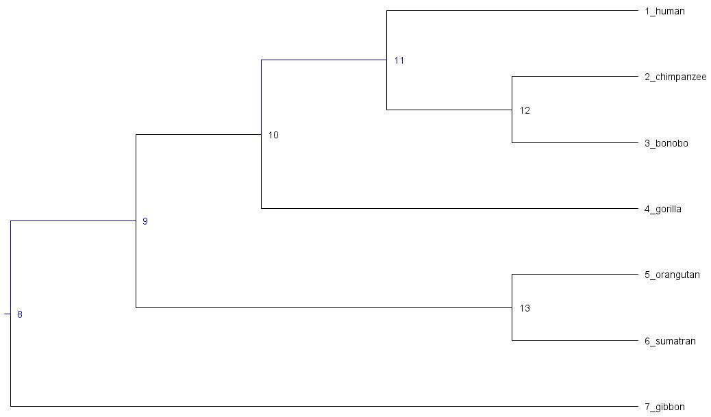
</p>

As you can see, the following nodes were calibrated:

* `t_n8`: root age, constrained with upper bound `U(1.0)` (maximum age = 1.0; time unit = 100Mya | 100 Mya).
* `t_n9`: last common ancestor of great apes (all taxa but gibbon), node constrained with soft bound `B(.12,.16)` (minimum age = 0.12, maximum age = 0.16; time unit = 100 Mya | 12 - 16 Mya).
* `t_n11`: last common ancestor of human, chimpanzee, and bonobo; node constrained with soft bound `B(.06,.08)` (minimum age = 0.06, maximum age = 0.08; time unit = 100 Mya | 8 Mya).

If you wanted to plot the calibration densities (those we specified in the tree file to constrain the) and see how they look like, you can use the `mcmc3r` R package to do so!

```r
# Open R on RStudio and, if you have already
# installed the `mcmc3r` R package you
# can run the following commands
#
# Create 1 row with 3 columns
# NOTE: The x axis will be reversed (i.e., from
# older to younger) so that it is
# easier to interpret the calibration densities
par( mfrow = c( 1, 3 ) )
##> Plot the upper-bound calibration for the root
curve( mcmc3r::dU( x, tU = 1.0 ), from = 0, to = 1.1,
       n = 1e4, xlim = rev( c( 0, 1.2 ) ),
       xlab = "Time (Mya)", ylab = "Density",
       main = "Soft Maximum t_n8 | 'U(1.0)'" )
abline( v = c( 1.0 ), col = "#56B4E9" )
##> Plot the soft-bound calibration for node 9, LCA of great apes
curve( mcmc3r::dB( x, tL = 0.12, tU = 0.16, pL = 0.025, pU = 0.025 ),
       from = 0.08, to = 0.2, n = 1e4, xlim = rev( c( 0.08, 0.2 ) ),
       xlab = "Time (Mya)", ylab = "Density",
       main = "Soft Maximum & Minimum t_n9 | 'B(0.12,0.16,0.025,0.025)'" )
abline( v = c( 0.12, 0.16 ), col = "#56B4E9" )
##> Plot the soft-bound calibration for node 11, LCA of H-C-B
curve( mcmc3r::dB( x, tL = 0.06, tU = 0.08, pL = 0.025, pU = 0.025 ),
       from = 0.04, to = 0.1, n = 1e4, xlim = rev( c( 0.04, 0.1 ) ),
       xlab = "Time (Mya)", ylab = "Density",
       main = "Soft Maximum & Minimum t_n11 | 'B(0.06,0.08,0.025,0.025)'" )
abline( v = c( 0.06, 0.08 ), col = "#56B4E9" )
```

<p align="center">
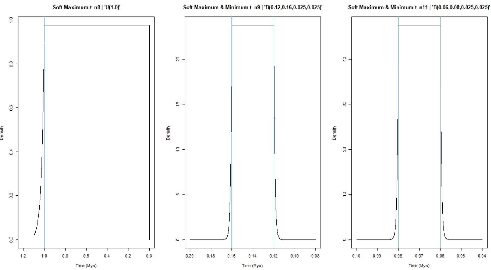
</p>

> [!NOTE]
> The plots above can be very useful to visualise how your prior/s to constrain node ages look/s like! This type of distribution is the "calibration density", although you can also find researchers in the literature referring to these distributions as the "user-specified" prior/s.

### Main MCMC diagnostics

Now that we have the output files from the different MCMC runs in an organised file structure, we are ready to run MCMC diagnostics! We will start by analysing the samples we collected when sampling from the prior and then, if there are no problems, we will proceed to analyse those collected when sampling took place from the posterior as the target distribution.

#### Prior

Firstly, we are going to check the `mcmc.txt` output files for all the chains we ran when sampling from the prior as the target distribution. For visual plots, we can use `Tracer`! Below, you can find some examples of how the plots may look like:

> Marginal densities for the root age

<p align="center">
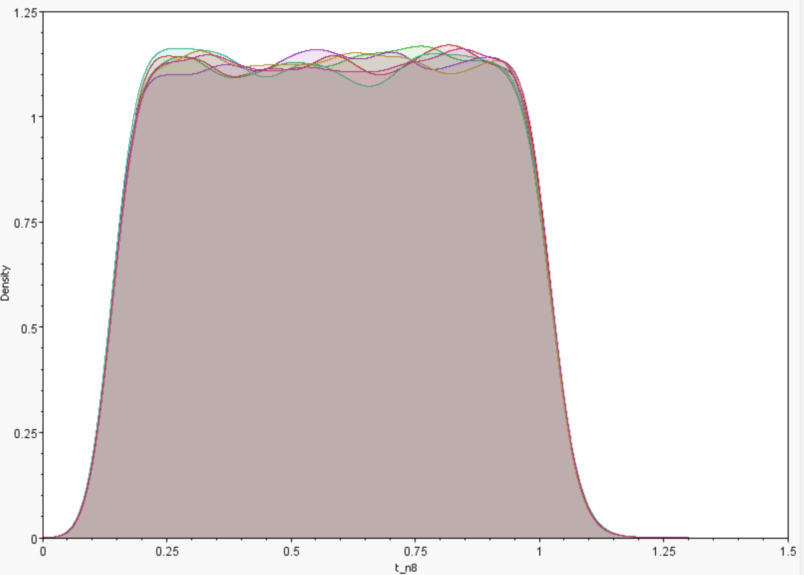
</p>

> Traces for the root age

<p align="center">
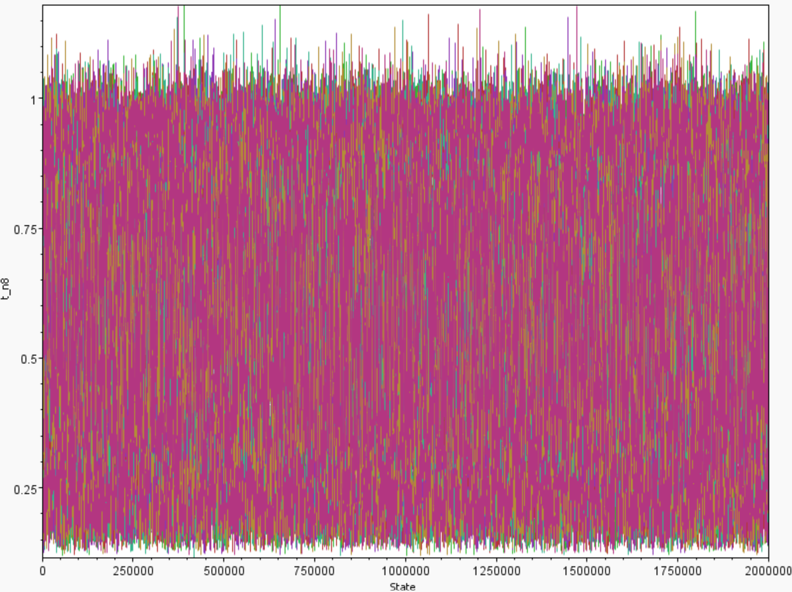
</p>

> All marginal densities together

<p align="center">
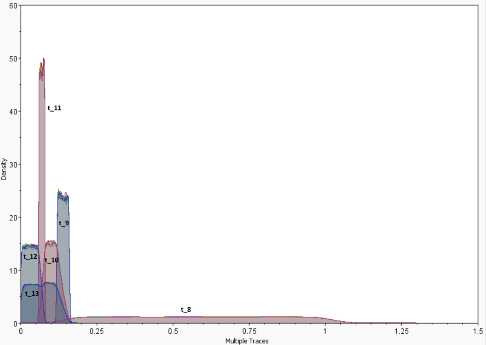
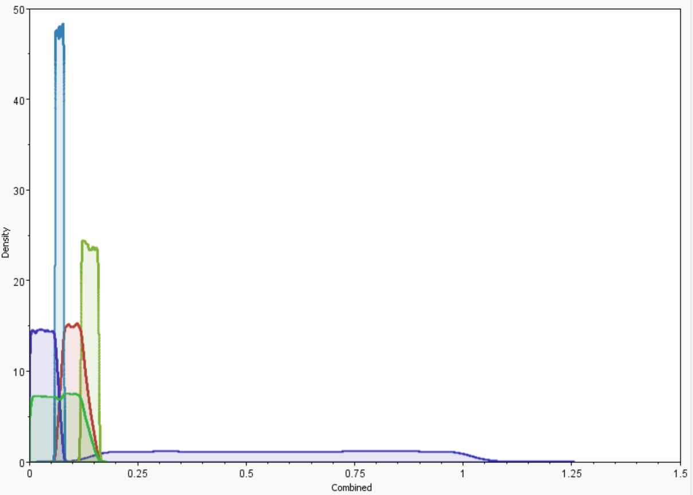
</p>

It seems that there are no problematic chains and, given that all the chains seem to have converged to the same target distribution, we can concatenate all the samples collected across the chains in a unique file:

```sh
## Run from `02_PAML/scripts`
# Please change directories until
# you are there. Then, run the following
# commands.
chmod 775 *sh
cp Combine_MCMC.sh ../01_MCMCtree/00_prior
# One argument taken: number of chains
cd ../01_MCMCtree/00_prior
# Change permissions in case you still
# do not have them
chmod 775 *sh
## Variables needed
## arg1 --> path to directory where analyses have taken place (e.g., CLK, GBM, ILN)
## arg2 --> output dir: mcmc_files_CLK, mcmc_files_GBM, mcmc_files_ILN, etc.
## arg3 --> "`seq 1 36`", "1 2 5", etc. | depends on whether some chains were filtered out or not
## arg4 --> clock model used: ILN, GBM, CLK
## arg5 --> number of samples specified to collect in the control file to run `MCMCtree`
## arg6 --> 'Y' to generate a directory with files compatible with programs such as `Tracer` to visually
##          inspect traceplots, convergence plots, etc. 'N' otherwise
## arg7 --> if arg6 is 'Y', arg7 needs to have a name for the `mcmcf4traces_<name>` that will be
##          generated. If `arg6` is equal to 'N', then please write `N` too.
path_to_data=$( echo NODAT )
num_dat=1
name_dat=( 'mtcdnapri' ) # if you had more datasets, you would add them here!
count=-1 #  counter will start at 0 in first iteration!
for i in `seq 1 $num_dat`
do
count=$(( count + 1 ))
# Run the in-house script to generate concatenated
# `mcmc.txt` file and the individual `mcmc.txt` files
# ready to visually inspect in e.g., Tracer
./Combine_MCMC.sh $path_to_data mcmc_files_${name_dat[count]}_NODAT "`seq 1 6`" NODAT 20000 Y ${name_dat[count]}_NODAT
done
```

> [!NOTE]
> Given that there is only one dataset, the command above would essentially be the following:
>
> ```sh
> ./Combine_MCMC.sh NODAT mcmc_files_mtcdnapri_NODAT "`seq 1 6`" NODAT 20000 Y mtcdnapri_NODAT
> ```
>
> Nevertheless, we have written the full `for` loop in case you want to reuse this script with your data!

The script above will generate a directory called `mcmc_files_<name_dataset>_NODAT` inside the `00_prior` directory, where the `mcmc.txt` with the concatenated samples will be saved. In addition, a directory called `mcmcf4traces_<namedataset>_NODAT` will also be generated so that formatted MCMC files compatible with programs such as `Tracer` can be used to check for chain convergence.

A template script to generate the `FigTree.tre` file with this concatenated `mcmc.txt` has been also saved inside the [`dummy_ctl_files`](02_PAML/dummy_ctl_files) directory. In addition, a dummy alignment with only 2 amino acid residues has been saved inside `dummy_aln` to quickly run `MCMCtree` with option `print = -1`. This setting will basically (i) ignore all the settings regarding the evolutionary model and the MCMC, (ii) read the `mcmc.txt` file which path is set in option `mcmcfile`, (iii) and summarise all the samples in such file to generate a timetree. Now, we are ready to run `MCMCtree` with option `print = -1`! Note that the `mcmc.txt` file will have all the samples collected by the chains that passed previous filters during MCMC diagnostics.

> [!IMPORTANT]
> To avoid copying input files again, we have already prepared the aforementioned dummy control file with the relative paths to the input sequence data!

```sh
## Run from `00_prior`
# You should still be in this directory 
# but, if not, please change directories until
# you are there. Then, run the following
# commands.
name_dat=( 'mtcdnapri' ) # you would list more datasets here
num_dat=1
count=-1
for i in `seq 1 $num_dat`
do
printf "\n[[ ANALYSING DATASET "${name_dat[count]}" ]]\n\n"
count=$(( count + 1 ))
base_dir=$( pwd )
# Go to directory where the concatenated
# `mcmc.txt` file is and start preparing
# the directory to run `MCMCtree` with
# option `print = -1`
cd mcmc_files_${name_dat[count]}_NODAT
printf "[[ Generating tree file for concatenated \"mcmc.txt\"  ... ... ]]\n"
cp ../../../dummy_ctl_files/*ctl .
# Run now `MCMCtree` after having modified
# the global vars according to the path to
# these files. Then, rename the output tree
# file so we can easily identify later which
# tree belongs to which dataset easier
mcmctree *ctl
mv FigTree.tre FigTree_${name_dat[count]}"_NODAT_95HPD.tree"
cd $base_dir
done
```

> [!NOTE]
> As per the previous code snippet, the `for` loop above would run once because there is only one dataset. Nevertheless, we have written the full `for` loop in case you want to reuse this script with your data!

#### Posterior

Now, we have to do the same for the samples we collected when running `MCMCtree` with our data! Firstly, let's check our trace files with `Tracer`! Below, you can find some examples of how the plots may look like:

> Marginal densities for the root age (GBM)

<p align="center">
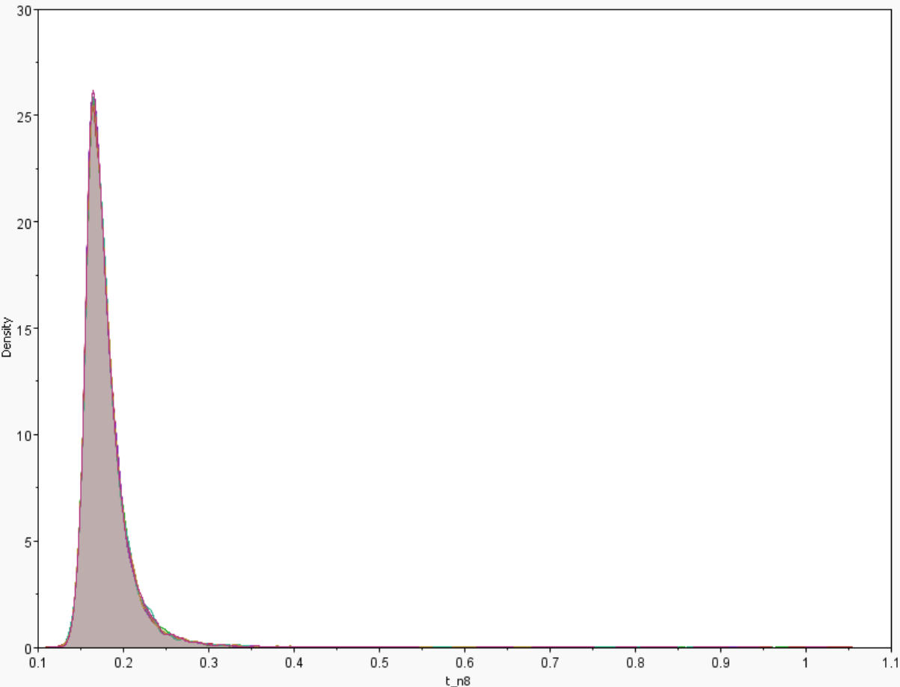
</p>

> Traces for the root age (GBM)

<p align="center">
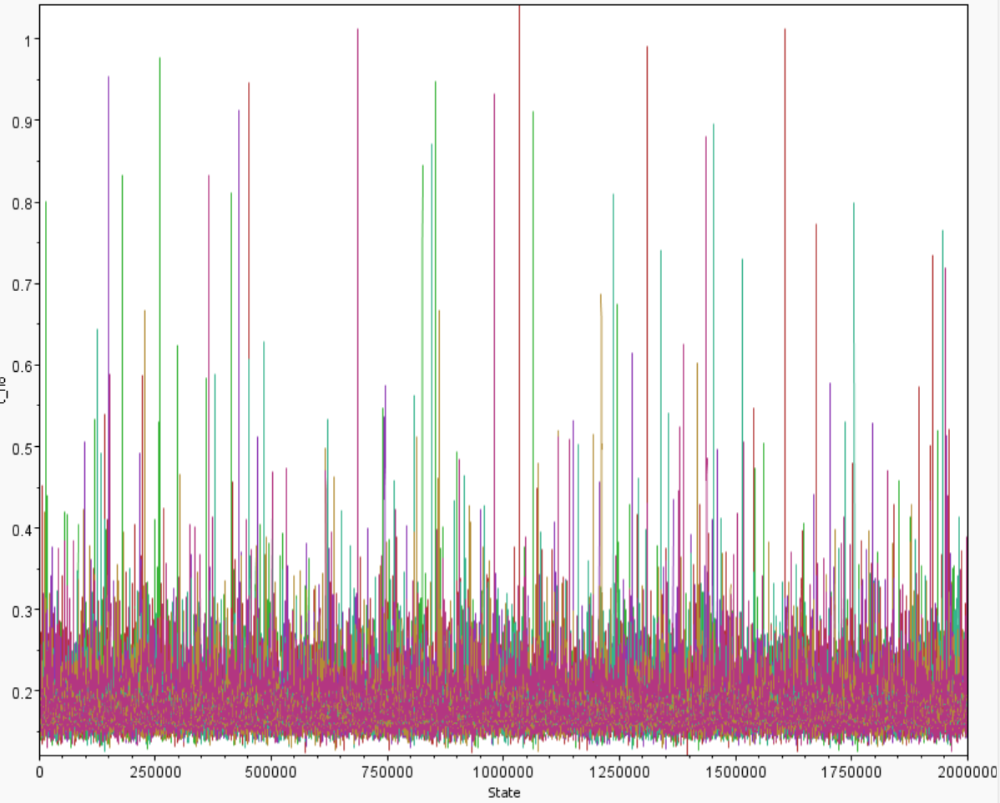
</p>

> All marginal densities together (GBM)

<p align="center">
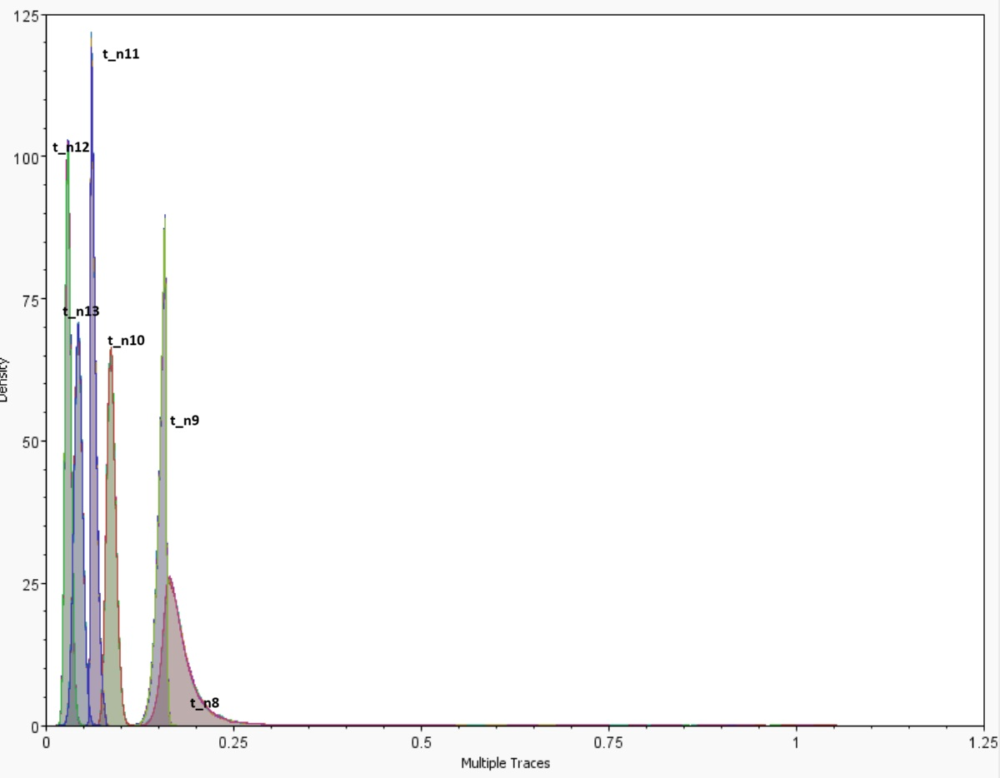
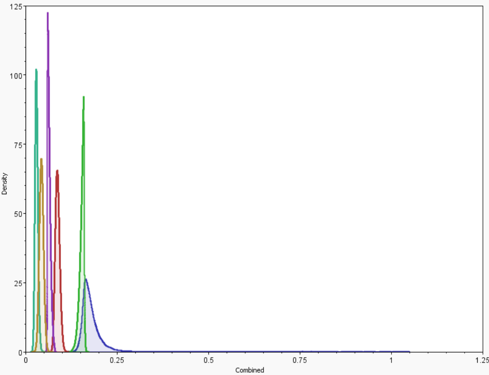
</p>

>> Similar plots are obtained when data were analysed under ILN!

We could also plot our marginal densities against our posterior time densities under both relaxed-clock models to check how informative the data we analyse are. If they are too similar, the data may not be quite informative about the parameters of interest (i.e., divergence times). The ideal scenario happens when both the prior and posterior densities overlap but the latter is narrower and more concentrated within the prior region: the prior is reasonable and the data are informative enough. If the prior and the posterior were in conflict, the prior may have been misspecified, and thus may have to be updated (e.g., plots showing the marginal densities against the calibration densities may be helpful in such cases!).

> [!IMPORTANT]
> Priors are specified before the data are analysed, and thus should never be made to match the posterior. You may want to read [Nascimento et al. 2017](https://www.nature.com/articles/s41559-017-0280-x.pdf) for more details on the matter!

<p align="center">
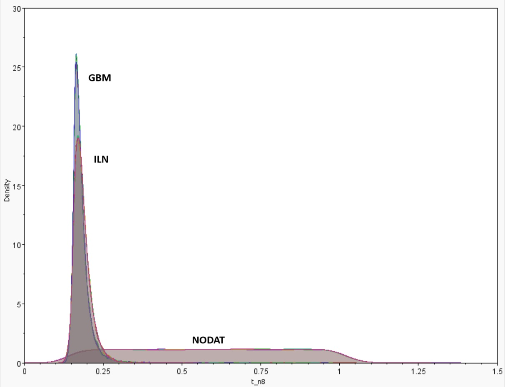
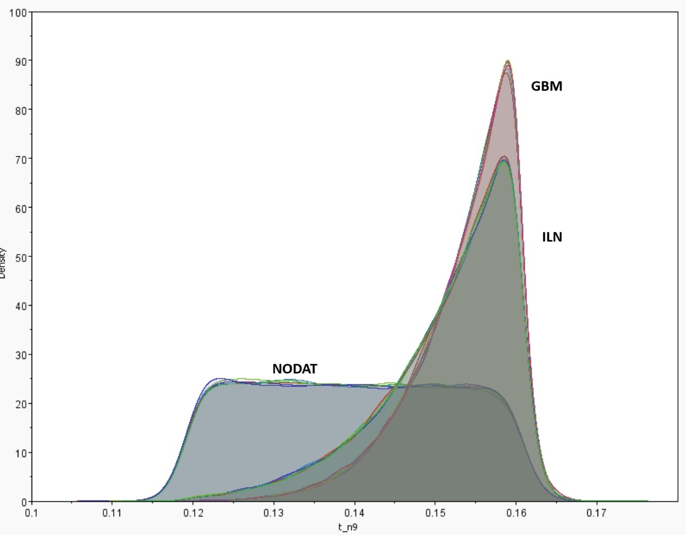
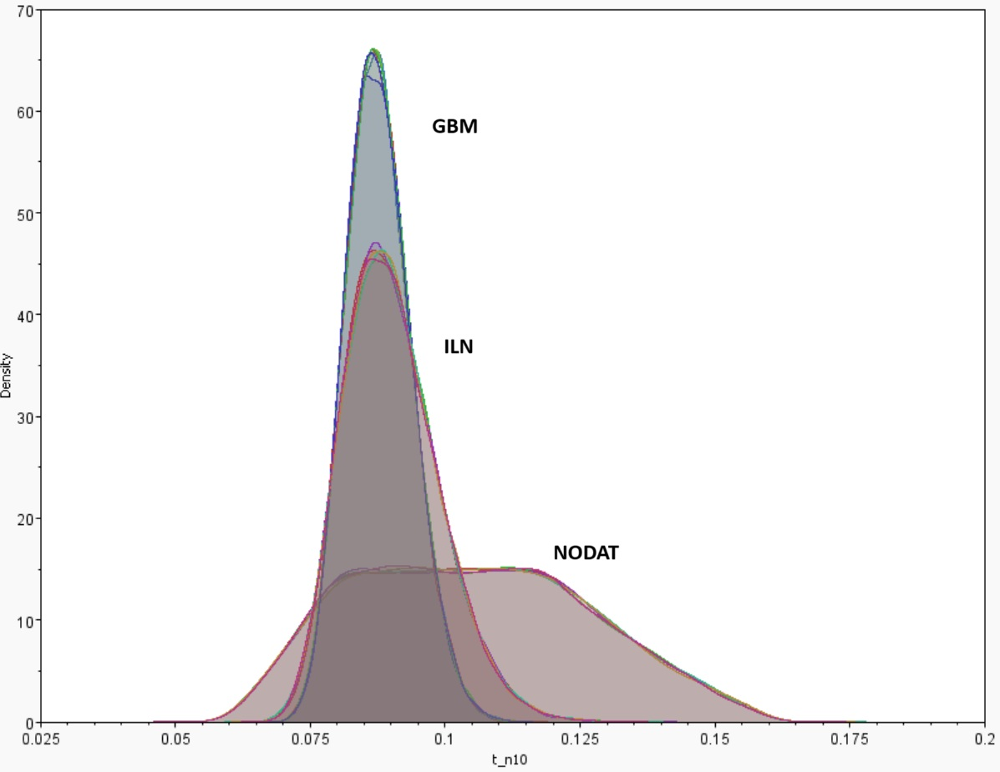
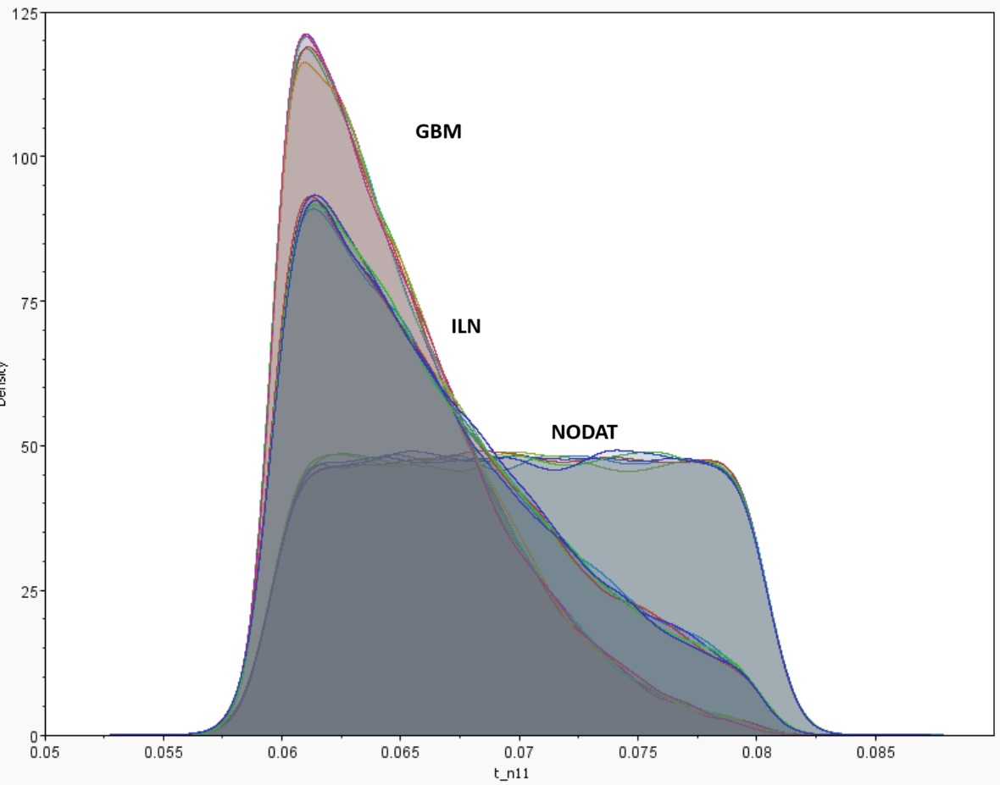
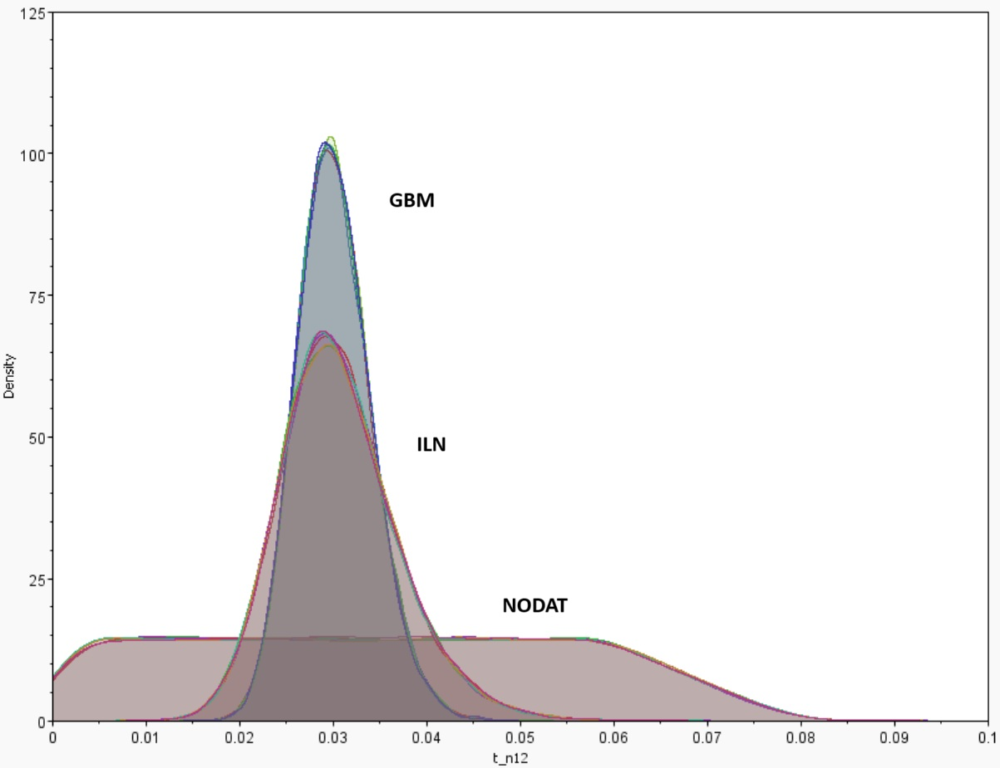

</p>

It seems that there are no problematic chains when we ran `MCMCtree` with our data, and the data seem informative enough given that the posterior densities are more concentrated than the marginal densities and within these densities. In addition, the traces and convergence plots seem to show that all the chains have converged to the same target distribution under each model, respectively. Consequently, we can concatenate all the samples collected across the chains in a unique file for each clock, respectively:

```sh
## Run from `02_PAML/scripts`
# You should still be in this directory 
# but, if not, please change directories until
# you are there. Then, run the following
# commands.
cp Combine_MCMC.sh ../01_MCMCtree/01_posterior
# One argument taken: number of chains
cd ../01_MCMCtree/01_posterior
# Change permissions in case there are 
# still problems
chmod 775 *sh
## Variables needed
## arg1 --> path to directory where analyses have taken place (e.g., CLK, GBM, ILN)
## arg2 --> output dir: mcmc_files_CLK, mcmc_files_GBM, mcmc_files_ILN, etc.
## arg3 --> "`seq 1 36`", "1 2 5", etc. | depends on whether some chains were filtered out or not
## arg4 --> clock model used: ILN, GBM, CLK
## arg5 --> number of samples specified to collect in the control file to run `MCMCtree`
## arg6 --> 'Y' to generate a directory with files compatible with programs such as `Tracer` to visually
##          inspect traceplots, convergence plots, etc. 'N' otherwise
## arg7 --> if arg6 is 'Y', arg7 needs to have a name for the `mcmcf4traces_<name>` that will be
##          generated. If `arg6` is equal to 'N', then please write `N` too.
path_to_data=( 'ILN' 'GBM' )
num_clock=2
num_dat=1
name_dat=( 'mtcdnapri' ) # if you had more dataset, you would add them here!
count=-1 #  counter will start at 0 in first iteration!
count_clock=-1
for i in `seq 1 $num_dat`
do
count=$(( count + 1 ))
for j in `seq 1 $num_clock`
do
count_clock=$(( count_clock + 1 ))
./Combine_MCMC.sh ${path_to_data[count_clock]} mcmc_files_${name_dat[count]}_${path_to_data[count_clock]} "`seq 1 6`" ${path_to_data[count_clock]} 20000 Y ${name_dat[count]}_${path_to_data[count_clock]}
done
# Reset clock counter for next dataset
count_clock=-1
done
```

> [!NOTE]
> Given that there is only one dataset, the commands above would essentially be the following:
>
> ```sh
> ./Combine_MCMC.sh ILN mcmc_files_mtcdnapri_ILN "`seq 1 6`" ILN 20000 Y mtcdnapri_ILN
> ./Combine_MCMC.sh GBM mcmc_files_mtcdnapri_GBM "`seq 1 6`" GBM 20000 Y mtcdnapri_GBM
> ```
>
> Nevertheless, we have written the full `for` loop in case you want to reuse this script with your data!

Once the scripts above have finished, directories called `mcmc_files_part_(GBM|ILN)` and `mcmcf4traces` will be created inside `01_posterior/`. To map the mean time estimates with the filtered chains, we will use the dummy control file and dummy alignment file we already used when summarising those samples collected from the prior:

```sh
## Run from `01_posterior`
# You should still be in this directory 
# but, if not, please change directories until
# you are there. Then, run the following
# commands.
name_clock=( 'ILN' 'GBM' )
num_clock=2
name_dat=( 'mtcdnapri' )
num_dat=1
count=-1
count_clock=-1
for i in `seq 1 $num_dat`
do
printf "\n[[ ANALYSING DATASET "${name_dat[count]}" ]]\n\n"
count=$(( count + 1 ))
base_dir=$( pwd )
for j in `seq 1 $num_clock`
do
count_clock=$(( count_clock + 1 ))
# Go to directory where the concatenated
# `mcmc.txt` file is and start preparing
# the directory to run `MCMCtree` with
# option `print = -1`
cd mcmc_files_${name_dat[count]}"_"${name_clock[count_clock]}
printf "[[ Generating tree file for concatenated \"mcmc.txt\" for "${name_clock[count_clock]}" ... ... ]]\n"
cp ../../../dummy_ctl_files/*ctl .
# Run now `MCMCtree` after having modified
# the global vars according to the path to
# these files. Then, rename the output tree
# file so we can easily identify later which
# tree belongs to which dataset easier
mcmctree *ctl
mv FigTree.tre FigTree_${name_dat[count]}"_"${name_clock[count_clock]}".tree"
printf "\n"
# Come back to main dir
cd $base_dir
done
done
```
